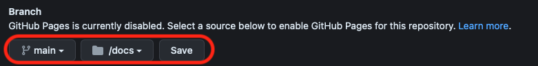

# Vite Javascript

Goal: type checking en code completion voor een OOP Excalibur Javascript project


<br>
<br>
<br>

## Setup

- fork en clone deze repo, typ in terminal

```bash
npm install
npm dev
```
<br>
<br>
<br>

## Setup from scratch

Maak een `vite` project en installeer `excalibur`. In setup kies je voor `vanilla` en `javascript`.

```bash
npm create vite@latest
cd name-of-project
npm install excalibur
npm dev
```
Je kan excalibur nu gebruiken met
```javascript
import { Actor, Engine } from "excalibur"
```
Je kan images laden als volgt:
```javascript
import { ImageSource } from "excalibur"
import fishImage from '../images/fish.png'
let Resources = {
    Fish: new ImageSource(fishImage)
}
```
<br>
<br>
<br>

## Publiceren naar Github Pages

Voor github pages moet je eindproject in een `docs` folder staan. In de ***github pages settings*** kies je voor ***publish main > docs***.



Je publiceert je project via `npm build`. Er wordt dan een docs folder aangemaakt. Je moet in `package.json` het `build` commando aanpassen zodat de juiste map wordt gebruikt: 

```json
"scripts": {
  "build": "vite build --outDir=docs --base=/projectnaam/",
},
```
> *Voorbeeld: als je project gaat draaien op `https://jouwnaam.github.io/projectnaam/`, dan vul je `/projectnaam/` in*

<br>
<br>
<br>

### Testen of publiceren werkt

Om te testen of het publiceren werkt kan je een `preview` doen. Voeg deze regel toe aan je `package.json`. Dit is hetzelfde als `build`, maar nu gebruik je het pad naar je lokale project.

```json
  "scripts": {
    "preview": "vite preview --outDir=docs --base=/~henk/prg4/les1/docs/"
  },
```
> *Voorbeeld: als je werkt in `http://localhost/~henk/prg4/les1/docs/`, dan vul je `/~henk/prg4/les1/docs/` in*